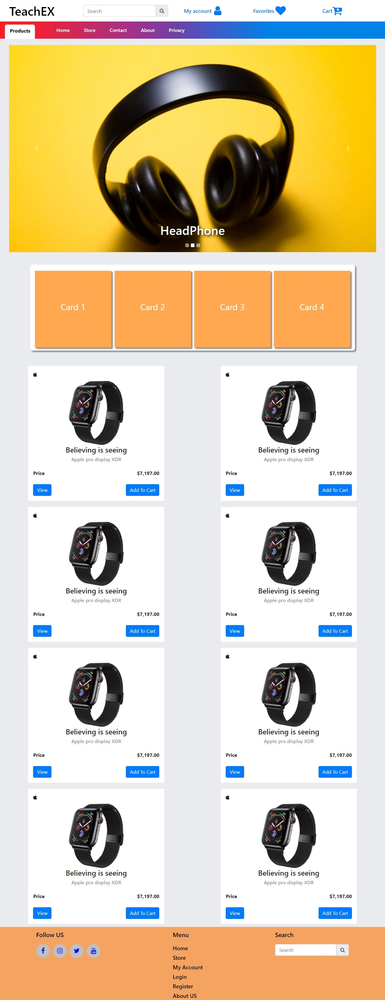
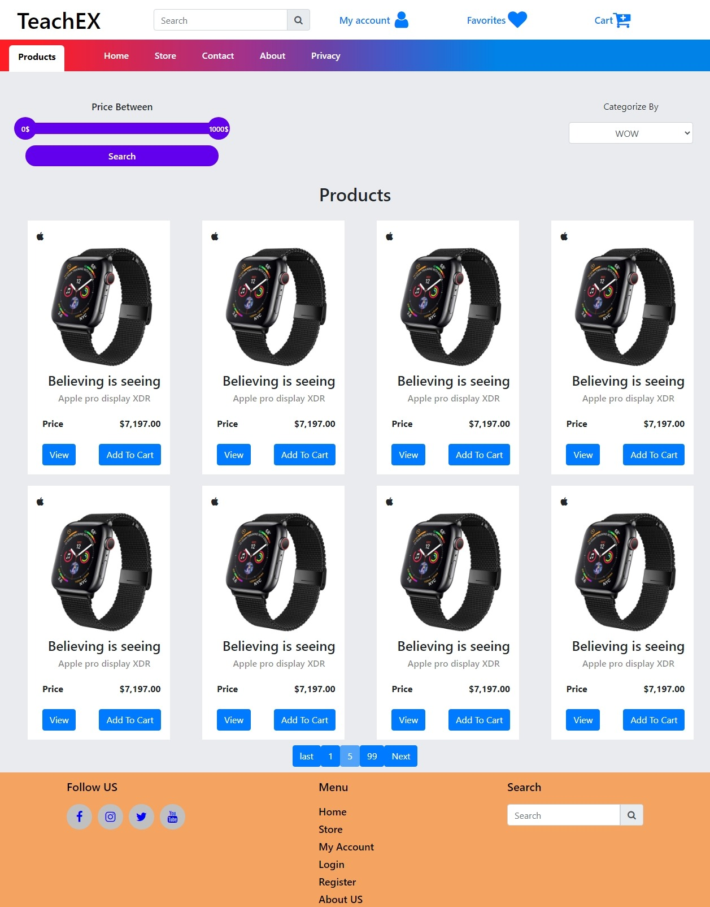
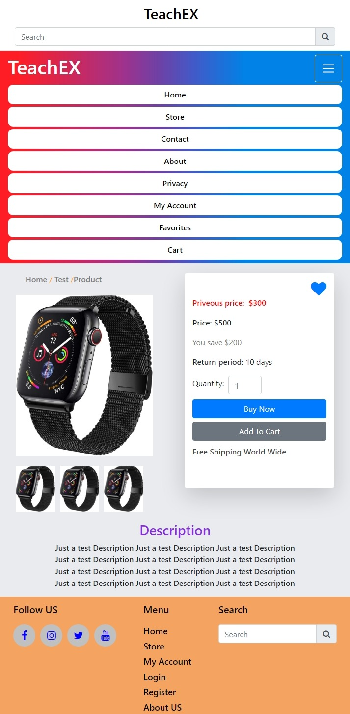
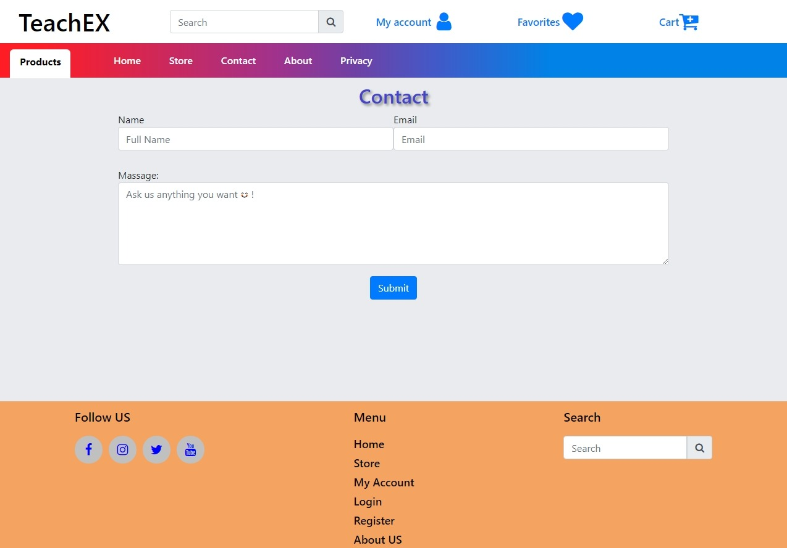
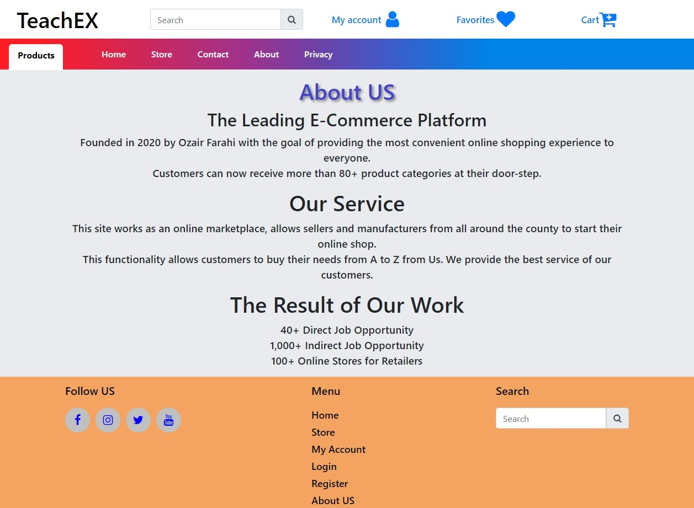
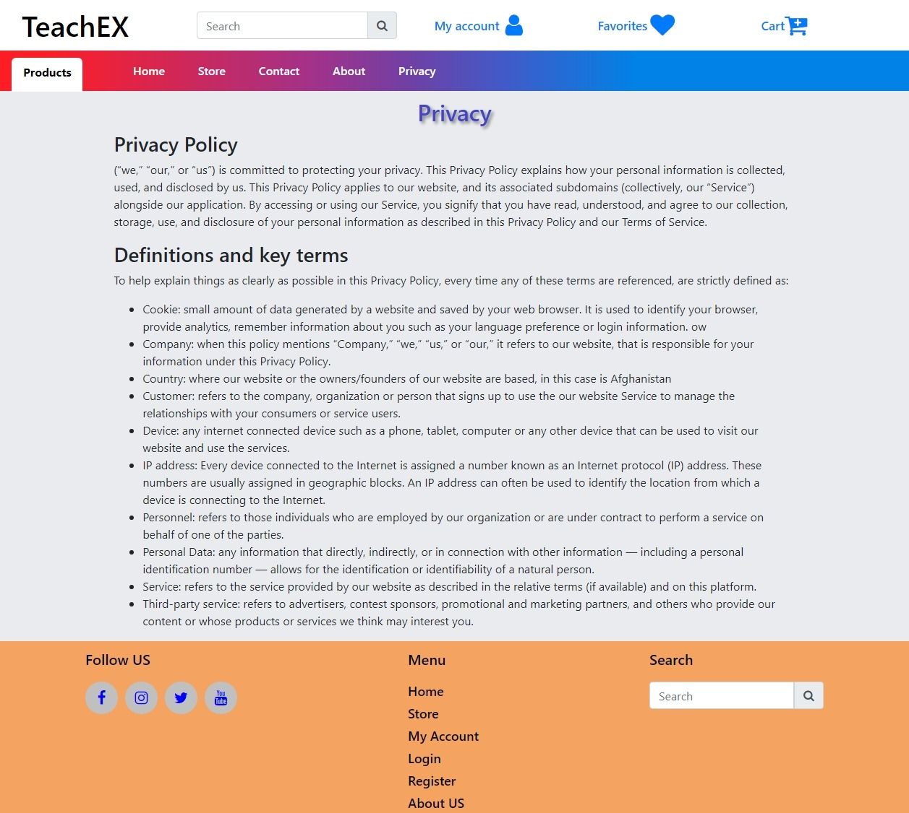

# E-Commerce Website built using NextJS, Express & MongoDB

## Status

- [x] Home Page
- [x] Store Page
- [x] Product Page
- [x] Mobile View
- [x] Contact Page
- [x] About Page
- [x] Privacy Page
- [ ] Cart Page
- [ ] Checkout Page
- [ ] Favorite Page
- [ ] Login Page
- [ ] Register Page
- [ ] Account Page
- [ ] ...

### Installation

1. Clone the repo

   ```sh
   git clone https://github.com/Ozair0/e-comeerce-nextjs.git
   ```

2. Install NPM packages

   ```sh
   npm install
   ```

3. Run in development

   ```sh
   npm run dev
   ```

### Run in production

1. Build

   ```sh
   npm run build
   ```

2. Run

   ```sh
   npm run start
   ```

## Pages

### Home



### Store



### Product Details


### Mobile View



### Contact



### About US



### Privacy


